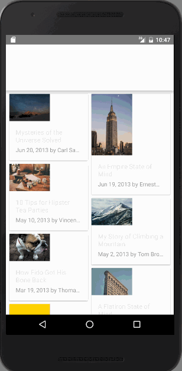
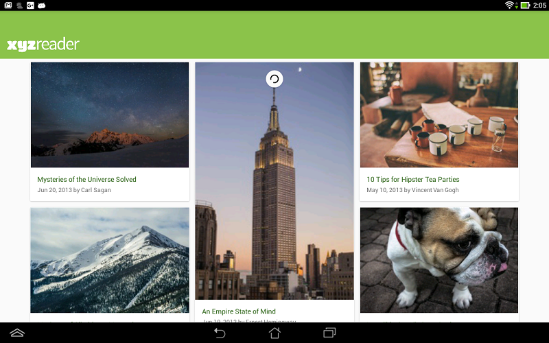

# Making your app material

In this project I applied the principles of Material Design using the design support library.
Some changes:
- color palette
- design support library
- swipe animation on items
- shared transitions between activities
- custom FAB behavior: it shows/hides on scroll
- better responsiveness to screen sizes

> Before. Original Application
>
> 

> After. Updated to use Material Design.
>
>

> Table size
>
> 